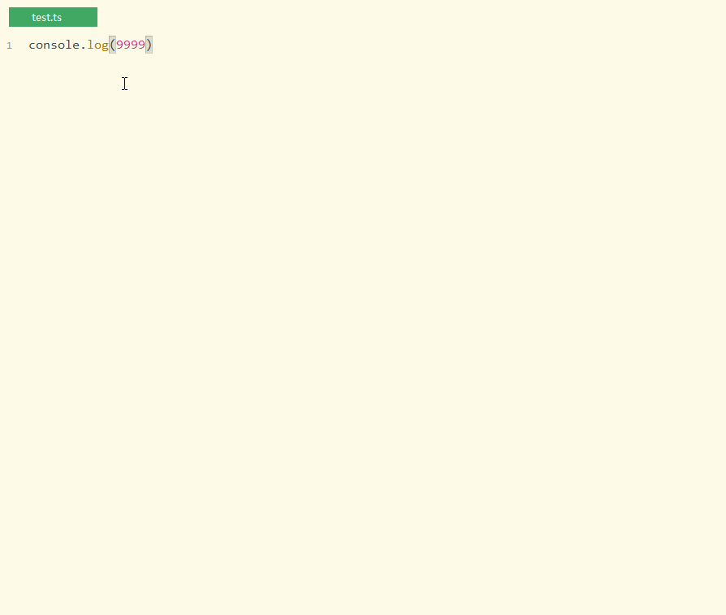

# 浏览器搜索

## 使用
> 主要有两种方式使用

### 1. 右键

选中文本 > 右键 > 浏览器搜索

> 使用效果

### 2. 快捷键方式

默认没有配置，如果需要使用这个模式，可以到`工具 > 自定义快捷键`进行配置

> 示例配置（配置command为`extension.search_QuickPick`）

> 使用效果

## 配置项

### 搜索引擎

内置了多个引擎，按需选择即可

### 自定义引擎

* 自定义引擎会作为默认的搜索引擎使用
* 没有自定义引擎时，使用已经选择的搜索引擎

### 使用内置浏览器模式

* 勾选时，将在HBuilderX中创建web页面；
* 不勾选时，使用系统默认浏览器搜索

> 应用内打开时，可以通过`视图 > 插件扩展视图 > 浏览器搜索`关闭

### 使用移动端引擎

* 勾选时，会尝试访问引擎对应的移动端页面（如果有的话）
* 在使用内置浏览器模式时建议勾选

